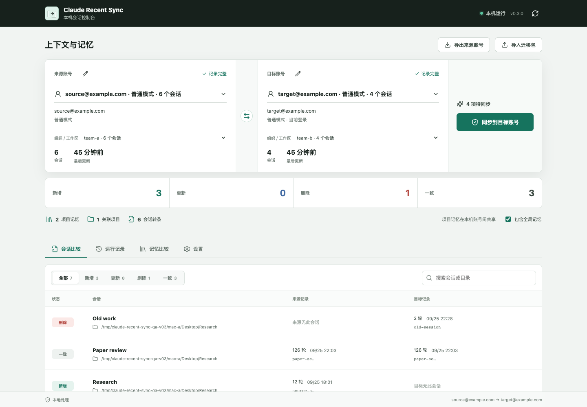

# Claude Recent Sync

[English](../README.md)

以**来源账号 → 目标账号**为基准，同步 Claude Desktop Code 的会话入口、完整上下文和项目记忆。支持同一台 Mac 内转移，也支持通过加密迁移包迁到另一台 Mac。



## 0.3 版变化

- 按邮箱选择来源、目标账号，再单独选择组织/工作区。
- 普通模式 `Claude` 和第三方模式 `Claude-3p` 分开显示。
- 来源必须明确选择，不再根据修改时间自动猜测。
- 分别比较会话与记忆文件的新增、更新、删除或共享状态。
- 同步绑定预览时选定的账号；数据发生变化时需刷新比较。
- 加密 `.crsync` 迁移包携带所选会话、关联旧分支、子会话、附件、文件历史和项目记忆。
- 跨 Mac 自动映射用户名目录，可单独修正已移动的项目路径。
- 写入前备份，写入后及延迟复查；跨机导入失败自动回滚。

## 安装

需要 macOS 12+、Python 3.9+，以及支持 PBKDF2 的 OpenSSL/LibreSSL。Node.js 仅用于前端开发。

```bash
git clone https://github.com/Beiciccc/claude-recent-sync.git
cd claude-recent-sync
./scripts/install-macos-app.sh
open "$HOME/Applications/Claude Recent Sync.app"
```

应用会打开本地控制台 `http://127.0.0.1:47631`。安装包包含程序与已构建的界面，使用安装时选定的 Python，并进行本地 ad-hoc 签名。

## 本机账号之间同步

1. 按邮箱选择“来源账号”和“目标账号”。
2. 分别确认组织/工作区，以及普通模式或第三方模式。
3. 查看“会话比较”和“记忆比较”。
4. 点击“同步到目标账号”。
5. 等待完整性检查和延迟复查完成。

目标会话列表将与来源一致，目标独有入口会被删除，来源保持原样。

Claude 的转录和项目记忆在同一台 Mac 上按项目共享，并非每个账号各有一份独立历史记忆。本机转移会核验并关联这些已有内容，界面标记为“共享”。

### 账号邮箱

工具从本机 CLI 登录资料及已知配置备份中读取明确的“账号 ID + 邮箱”对应关系，并在换号后保留已识别邮箱。不会根据对话内容猜测邮箱，也不会解密凭据缓存。

无法自动识别的历史账号显示为“待绑定账号”。选中后，点击来源或目标标题旁的铅笔图标填写邮箱；同一窗口也能清除手动绑定。绑定只修改显示名称，不会改变 Claude 登录状态或实际同步目标。相同邮箱的普通模式和第三方模式仍是两个独立目标。

邮箱对应表仅保存在本机 `~/.claude/claude-recent-sync/account-emails.json`。导出时，来源邮箱随加密迁移包携带；旧版无邮箱迁移包可在导入后手动绑定。

## 迁移到另一台 Mac

源电脑：

1. 选择来源账号及工作区。
2. 选择是否包含全局记忆。
3. 点击“导出来源账号”，记录迁移口令。
4. 下载加密的 `.crsync` 文件。

通过移动硬盘、AirDrop、iCloud Drive 等你选定的方式搬运该文件。软件本身不会自动上传文件。

目标电脑：

1. 安装本工具，在 Claude Desktop 登录目标账号，并打开一次 Code。
2. 点击“导入迁移包”，选择文件并输入迁移口令。
3. 来源会切换为迁移包中的账号快照，再选择目标账号及工作区。
4. 检查会话、记忆和项目路径；目录已移动时，在“项目路径映射”中修正。
5. 点击“同步到目标账号”。

打开迁移包只会解密并预览，点击同步后才会改写目标账号。

## 同步范围

| 数据 | 处理方式 |
| --- | --- |
| Desktop Code 会话入口 | 镜像到明确选定的目标账号/工作区 |
| 主会话与关联旧分支 | 复制完整转录，调整运行路径，保留历史消息正文 |
| 子会话与相关附件 | 携带与所选会话关联的文件 |
| 同项目中未关联的其他会话 | 不会自动打包 |
| 项目记忆 | 携带相关共享记忆；导入时镜像对应记忆目录 |
| 全局记忆 | 可选；覆盖目标同名全局文件 |
| 目标其他未关联转录 | 保留 |
| 项目代码、文档、项目内 `CLAUDE.md` | 使用原有的项目搬运、Git 或 iCloud 同步 |
| 登录凭据、Cookie、钥匙串、模型服务配置 | 不迁移 |
| Claude.ai 网页/手机云端对话与记忆 | 不迁移 |

全局记忆可包含 `~/.claude/CLAUDE.md`、rules、commands、agents、skills 和已有的本地上下文桥接目录。项目记忆和全局记忆会影响同机使用它们的其他账号，界面会标明作用范围。

正在运行的进程、未落盘的消息、远程连接授权不会随文件迁移；自定义工具和依赖可能需要在新机配置。

## 口令与校验

迁移包采用 OpenSSL/LibreSSL 的 AES-256-CBC、PBKDF2，以及 HMAC-SHA256 校验封装。口令通过标准输入传给加密程序，不写入配置或任务历史。

导入前先验证校验标签，再解密；拒绝越界路径、链接和不符合清单的文件。解包内容上限为 32 GiB。目标电脑自身的登录状态保持原样。

打开迁移包后，解密工作副本保存在本地私有状态目录。请像其他 Claude 本地数据一样保护这些目录。

## 备份与恢复

“运行记录”中可以查看任务、打开备份或恢复。跨机导入会同时备份索引和被修改的上下文/记忆文件，写入或验证失败时回滚。恢复前也会先备份目标当前状态。

默认位置：

```text
~/.claude/backups/claude-recent-sync/
~/.claude/claude-recent-sync/exports/
~/.claude/claude-recent-sync/imports/
```

普通模式换号自动同步、登录时运行仍为可选项，默认关闭。手动转移始终以界面明确选定的账号为准。

## 命令行兼容

原来的索引命令仍可使用：

```bash
./bin/claude-recent-sync list
./bin/claude-recent-sync diff --from previous --to current
./bin/claude-recent-sync mirror --from previous --to current --dry-run
./bin/claude-recent-sync doctor current
./bin/claude-recent-sync ui
```

CLI 的 `current`、`previous` 保留原有语义；新界面和迁移包使用明确的账号及工作区身份。

## 开发

```bash
PYTHONPATH=src python3 -m unittest discover -s tests -v
cd frontend
npm ci
npm run build
```

前端产物写入 `src/claude_recent_sync/web_dist`。开发时可通过 `--claude-dir`、`--projects-dir` 和 `--state-dir` 隔离测试数据与备份。

测试覆盖账号/工作区选择、模式区分、过期预览、转录与记忆完整性、口令与文件校验、路径拒绝、路径映射、回滚、恢复和 HTTP 导出导入流程。

## 限制

这是非官方工具，与 Anthropic 无关联，依赖 Claude Desktop 当前本地数据结构。客户端升级后可能需要适配。同步前确认来源与目标，并结束正在进行的 Claude 工作。

[MIT 许可证](../LICENSE)
